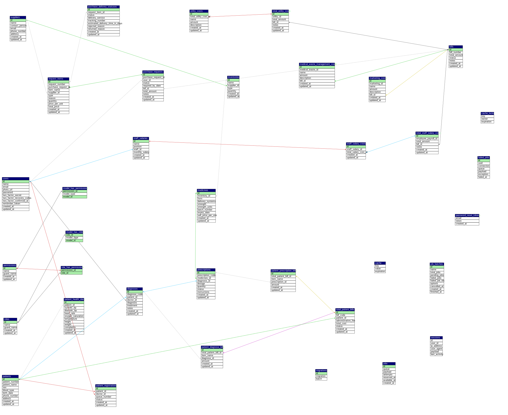

# Clinic App

## Overview
**Clinic App** is a comprehensive clinic management application designed to streamline healthcare operations. It handles everything from patient registration and medical records to inventory procurement and complex financial reporting.

> **Note:** This project uses **Google Cloud Storage (GCS)** to store photo files.
> 
> This work is licensed under a [Creative Commons Attribution-NonCommercial 4.0 International License](http://creativecommons.org/licenses/by-nc/4.0/).

[![CC BY-NC 4.0][cc-by-nc-shield]][cc-by-nc]

[cc-by-nc]: https://creativecommons.org/licenses/by-nc/4.0/
[cc-by-nc-shield]: https://img.shields.io/badge/License-CC%20BY--NC%204.0-lightgrey.svg


## Tech Stack
- **Laravel**
- **Inertia SSR**
- **React**

## Features

### 1. User & Access Control
- **User Data**: Create and manage system users (Doctors, Staff, Administrators).
- **Permissions**: Define specific permissions for system actions.
- **Roles**: Create roles by embedding permissions and assign these roles to users for access control.

### 2. Patient Care
- **Patient Data**: Create and maintain detailed patient profiles.
- **Health Data**: Record patient health metrics and vital signs linked to their profile.
- **Registration**: Register patients for treatment, linking them to specific doctors.
- **Diagnoses**: Record examination results based on patient and doctor data.
- **Prescriptions**: Create medicine prescriptions derived from patient diagnosis records.

### 3. Inventory & Procurement
- **Goods Procurement**: Manage data for purchasing clinic supplies.
- **Delivery Information**: Track delivery details for requested procurement items.
- **Inventory Management**: Automatically categorize inventory into **Goods** and **Medicines** based on procurement data.
- **Medicine Data**: Manage specific details for pharmaceutical stock based on inventory records.

### 4. Financial Management
- **Patient Billing**: Generate bills calculating costs from diagnoses and prescribed medicines.
- **Staff Salaries**: Manage monthly salary records for all staff.
- **Invoicing**:
  - **Staff Salary Invoices**: Generate invoices based on monthly salary data.
  - **Marketing Invoices**: Track monthly marketing expenditures.
  - **Medical Waste Invoices**: Manage costs for medical waste disposal.
  - **Utility Invoices**: Record monthly utility expenses.
- **Clinic Monthly Invoice**: Aggregate total monthly expenditures based on goods procurement invoices, monthly staff salary invoices, monthly utility invoices, and monthly medical waste management invoices.

### 5. Analytics & Reporting
- **Financial Graphs**: Visualize monthly income vs. expenditure over a one-year period.
- **Excel Export**: Export detailed financial data to Excel format for external analysis.

## Database Schema (ERD)

The following image represents the Entity-Relationship Diagram (ERD) for the project, detailing the table structures and relationships.



> **Documentation**: For a complete reference of the schema and page mappings, please view the [ERD Documentation (PDF)](./clinic_app.pdf).

## Project Folder Structure

The project follows a structured architecture (Laravel-based) to ensure maintainability and scalability.

| Directory | Description |
| :--- | :--- |
| `app/` | Contains the core code of the application (Models, Controllers, Services). |
| `bootstrap/` | Contains the bootstrap script and cache directories. |
| `config/` | Contains all of the application's configuration files. |
| `database/` | Contains database migrations, model factories, and seeds. |
| `public/` | The web server's document root, contains `index.php` and assets (images, js, css). |
| `resources/` | Contains views (Blade templates), raw assets (LESS, SASS, JS), and language files. |
| `routes/` | Contains all of the route definitions for the application. |
| `storage/` | Contains compiled Blade templates, file-based sessions, file caches, and logs. |
| `tests/` | Contains automated tests. |
| `vendor/` | Contains Composer dependencies. |

## Getting Started

1. **Clone the repository**
2. **Install dependencies**:
   ```bash
   composer install
   npm install
   ```
   - Build the frontend assets:
   ```bash
   npm run build
   ```
3. **Environment Setup**:
   - Copy `.env.example` to `.env`
   - Configure database and Google Cloud Storage (GCS) credentials.
4. **Run Migrations**:
   ```bash
   php artisan migrate
   ```
